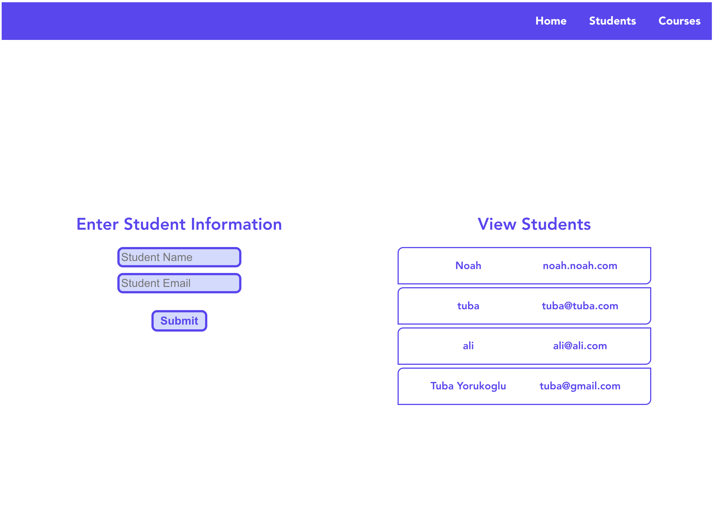

# **Course Manager**

## **_Table of Contents:_**

1. Collaborators
2. Motivation
3. Project Description
4. Technologies Used
5. Future Updates
6. Credits

[Github Repository](https://github.com/noahdvaughn/Course_Manager)

[Entity Relationship Diagram](https://app.diagrams.net/)

[Component Hierarchy Diagram](https://lucid.app/lucidchart/26f10400-37a9-4932-b61d-d4387149bc92/edit?viewport_loc=572%2C259%2C1128%2C1312%2C0_0&invitationId=inv_46cb8138-2d74-4d59-8d94-216fe372719d)

---

## **_Collaborators_**

|      Name      |                                                               GitHub                                                               |                                                                        LinkedIn                                                                         |
| :------------: | :--------------------------------------------------------------------------------------------------------------------------------: | :-----------------------------------------------------------------------------------------------------------------------------------------------------: |
|  Noah Vaughn   |  |                  |
|  Jakub Soraka  |      |                  |
| Tuba Yorukoglu |     |  |

---

### **_Motivation_**

Our motivation for this collaborative project was to refine our programming acumen; building on our existing knowledge of Vue, Express, and JavaScript, while integrating the additional technologies like PostgreSQL database. We accomplished this project together only in one and a half day in General Assembly's Software Engineering Immersive program.

---

### **_Description:_**

Course Manager is a full-stack application which is made with Javascript, Vue, PostgreSQL and node.js. It provides a simple platform for users that have ability to track students and their courses. The user can create and delete students and courses. They both have detail pages to show the students' grades in a different way. Also students can see their GPA when they enroll their grades for courses.

---

### **_Technologies Used_**

- HTML
- CSS
- JavaScript
- Vue
- Express.js
- Node.js
- PostgreSQL

---

### **_Future Updates_**

1. User authentication (Sign up/Login)
2. Search bar for courses and students
3. UI Library
4. External API
5. Data Visualization options
6. Update user profile

---

### **_Credits:_**

- MDN Web Docs
- W3 Schools
- Geeks for Geeks
- LucidApp
- draw.io
